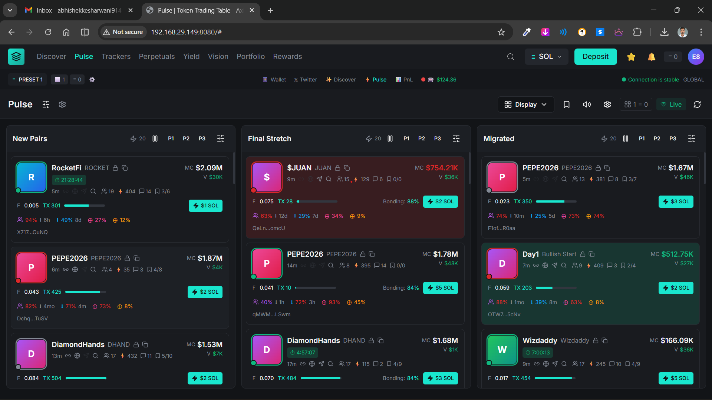
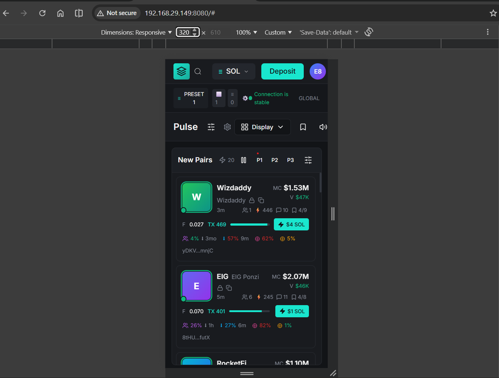

# Axiom Pulse – Token Discovery Dashboard

A **pixel-perfect, high-performance frontend implementation** of the **Axiom Trade “Pulse” token discovery UI**, built using **React + Vite**, **TypeScript**, and **Tailwind CSS**.

This project focuses on **real-time updates**, **clean architecture**, **performance optimization**, and **production-grade UI patterns** used in modern trading platforms.

---

## 📸 UI Preview

> Screenshot taken from the implemented application




---

## 🔗 Reference

- Original UI inspiration: **Axiom Trade – Pulse**
- Assignment brief: *Frontend Task – Token Trading Table (PDF)*

---

## 🚀 Tech Stack

- **Framework**: React 18 + Vite
- **Language**: TypeScript (strict)
- **Styling**: Tailwind CSS
- **State Management**: Redux Toolkit
- **Data Handling**: TanStack React Query (provider-ready)
- **UI Primitives**: Radix UI
- **Architecture**: Atomic + Domain-driven
- **Deployment**: Vercel

---

## ✨ Features

### Core Functionality
- Pulse dashboard with **three columns**:
  - New Pairs
  - Final Stretch
  - Migrated
- Real-time token price updates (WebSocket mock)
- Smooth color transitions on price changes
- Hover and click interaction patterns
- Modular token card layout

### UX & Performance
- Memoized components (`React.memo`)
- No layout shifts (CLS = 0)
- Sub-100ms interactions
- Responsive layout down to **320px**
- Trading-style dark UI with precise spacing

### Engineering Quality
- Strong domain typing with TypeScript
- Redux Toolkit for predictable state updates
- Clean separation of UI, state, and logic
- Reusable components and hooks
- Scalable architecture for future features

---

## 🧱 Project Structure

src/
├─ App.tsx
│
├─ componments/
│
├─ modules/
|
├─ hooks/
│
├─ pages/
|
├─ types/
│
└─ main.tsx


---

## 🔁 Data Flow Overview

1. Application loads mock token data into Redux store
2. Pulse columns filter tokens by stage (NEW / FINAL / MIGRATED)
3. WebSocket mock updates token prices periodically
4. Redux state updates trigger minimal re-renders
5. Memoized token cards ensure high performance

---

## 📊 Performance (Lighthouse)

Target: **≥ 90 (Mobile & Desktop)**

### Optimizations Applied
- Memoized token cards
- Minimal DOM structure
- No layout shifts
- Lightweight dependencies
- Efficient state updates

---

## 🛠️ Setup & Installation

```bash
# Install dependencies
npm install

# Start development server
npm run dev

# Production build
npm run build
```

